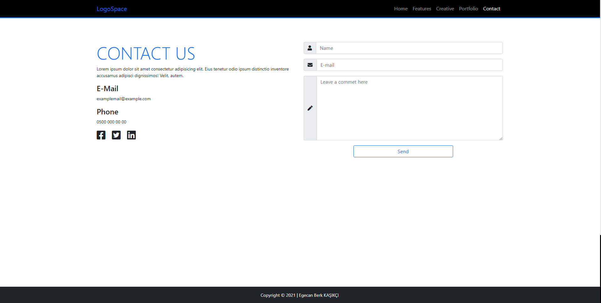

# Techcareer Bootcamp - Bootstrap 5

> Egecan Berk KAŞIKÇI
> > [LinkedIn](https://www.linkedin.com/in/egecanberk/)

## Sitenin yapım amacı:
Techcareer.net Bootcamp süreci içerisinde, Bootstrap 5 kullanılarak bir site geliştirilmesi istenmiştir. Bu doğrultuda Bootstrap 5 kullanılarak web sayfası geliştirilmiştir.

## Bootcamp Eğitimi Süresince Görülen Kategoriler:
- Temel kavramlar
- Yol haritası
- Kurulum ve genel ayarlar
- Visual studio code kullanımı
- HTML temelleri
- CSS temelleri
- Sass temelleri
- Bootstrap V5 temelleri

 ### Proje İçinden Görüntüler
   
   
   
   
  

### Kullanılan Kütüphaneler

> Bootstrap v5 Source
> [https://github.com/chnkc41/bootstrapV5](https://github.com/chnkc41/bootstrapV5)

> Fontawesome Icons
> [https://fontawesome.com/](https://fontawesome.com/)